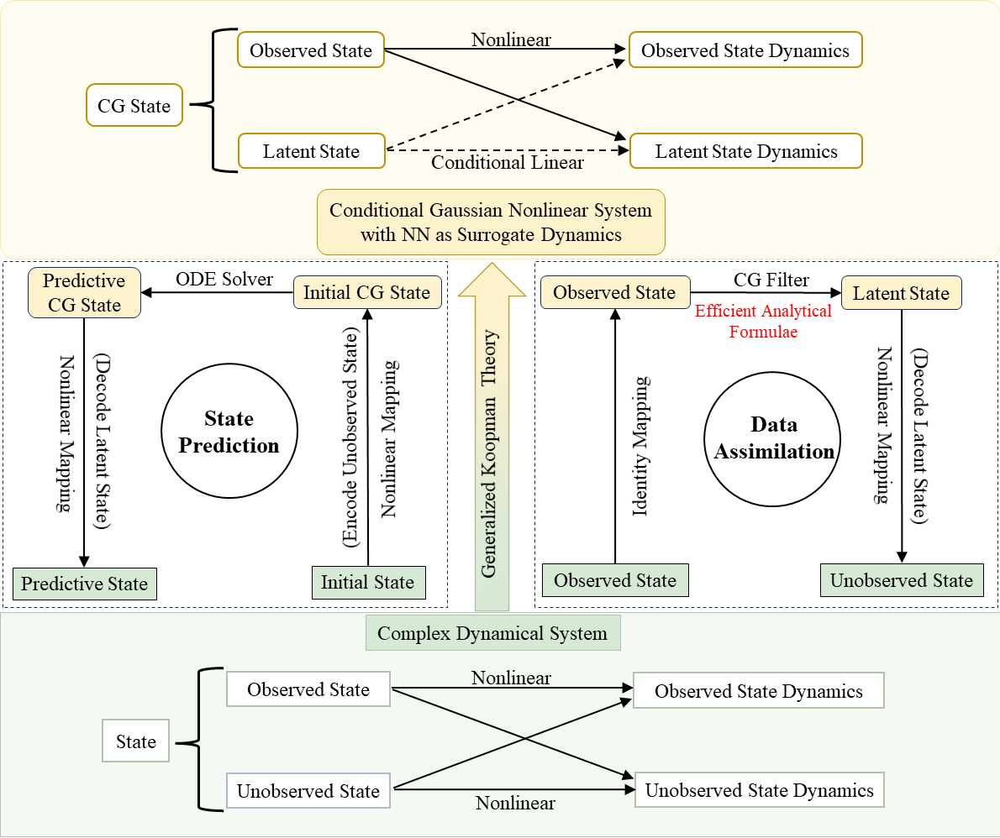
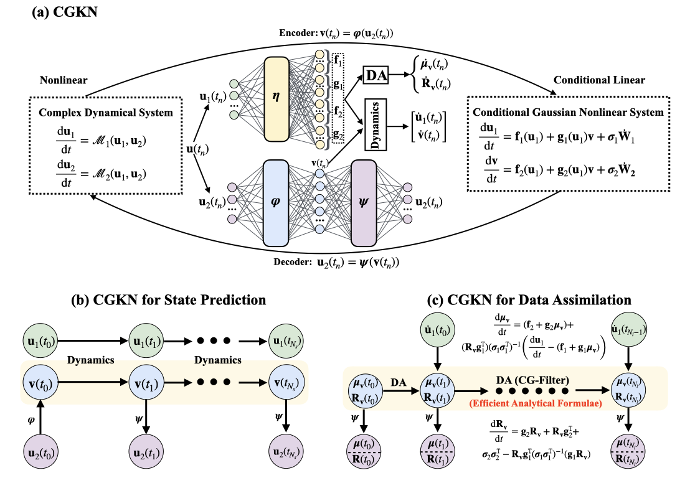

# CGKN: Conditional Gaussian Koopman Network

## A Deep Learning Framework for Modeling Complex Dynamical Systems, State Prediction, Data Assimilation and Uncertainty Quantification

This repository contains the code for the paper:
- [CGKN: A Deep Learning Framework for Modeling Complex Dynamical Systems and Efficient Data Assimilation
](https://arxiv.org/abs/2410.20072)

## Highlights:
- Modeling Complex Systems for Data Assimilation and State Forecast
- State Estimation for Partially-Observed Complex System via Data Assimilation
- Efficient Data Assimilation by Analytically Solvable Formulae
- Uncertainty Quantification for the Estimated States

<p align="center">

</p>

<p align="center">

</p>


## Citations
```
@article{chen2025CGKN,
  title = {{CGKN}: A Deep Learning Framework for Modeling Complex Dynamical Systems and Efficient Data Assimilation},
  author = {Chuanqi Chen and Nan Chen and Yinling Zhang and Jin-Long Wu},
  journal = {Journal of Computational Physics},
  pages = {113950},
  year = {2025},
  issn = {0021-9991},
  doi = {https://doi.org/10.1016/j.jcp.2025.113950},
}
```
